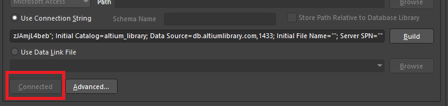
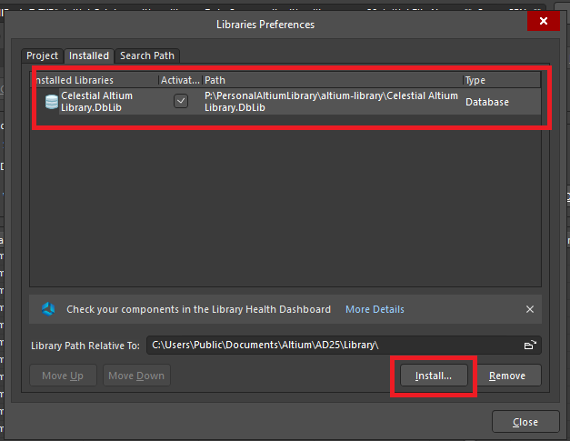

# Brief
This is my repository containing Altium Library, and guideline for install it, download it, compile it ...<br>
# Install python3:
```python3.exe```
# Altium automating script
Altium_Auto_Script contains DelphiScript to automating update library whenever a new IntLib file is added. <br>
+ Go to Altium_Auto_Script directory ```cd .\Altium_Auto_Script\ ```
+ Change ```source_dir``` variable on ```py.py``` file: ```source_dir = r"P:\PersonalAltiumLibrary\<Folder_to_Compile>"```<br>
  Also, check ```CompileLibraries.pas``` folder directory<br>
+ Run ```python3.13.exe .\py.py```
+ An Altium windows will be opened. This windows contains CompileLibraries.pas script to extract all existing IntLib to SchLib and PcbLib.<br>
    Run it by File -> Run Script. A new window will be prompted indicating that the process has finished. Close it <br  
+ Next, add newly extracted SchLib and PcbLib files on Temp folder of source_dir to IntLib<br>
  Compile it and close Altium
+ New IntLib library file will be created on ```<source_dir>/Output/<Folder_to_Compile>```
+ Manually add new IntLib to Altium library
# Celestial library
Double click on ```Celestial Altium Library.DbLib``` to open it on Altium<br>
Click Connect/Reconnect<br>
<br>
Move ```Celestial Altium Library.DbLib``` to ```altium-library``` folder<br>
Install ```Celestial Altium Library.DbLib```<br>
<br>
+ For troubleshooting: https://altiumlibrary.com/GetStarted/Troubleshooting
+ Git repo: https://github.com/issus/altium-library.git
